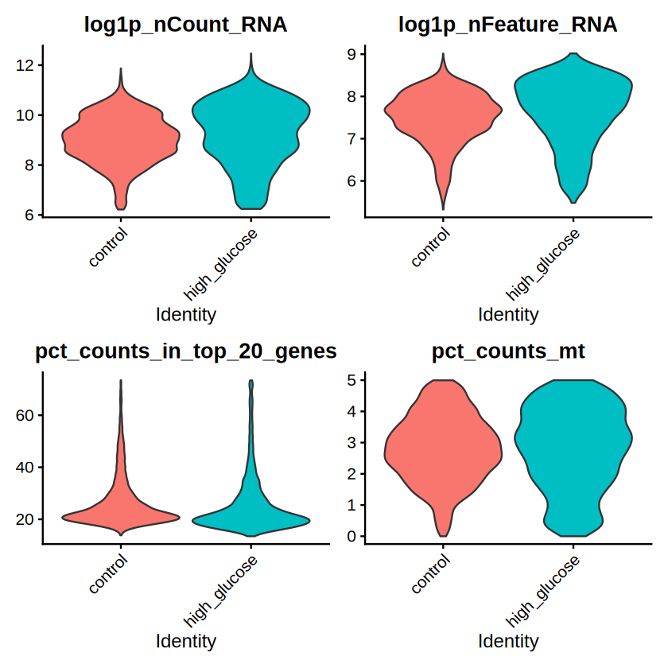
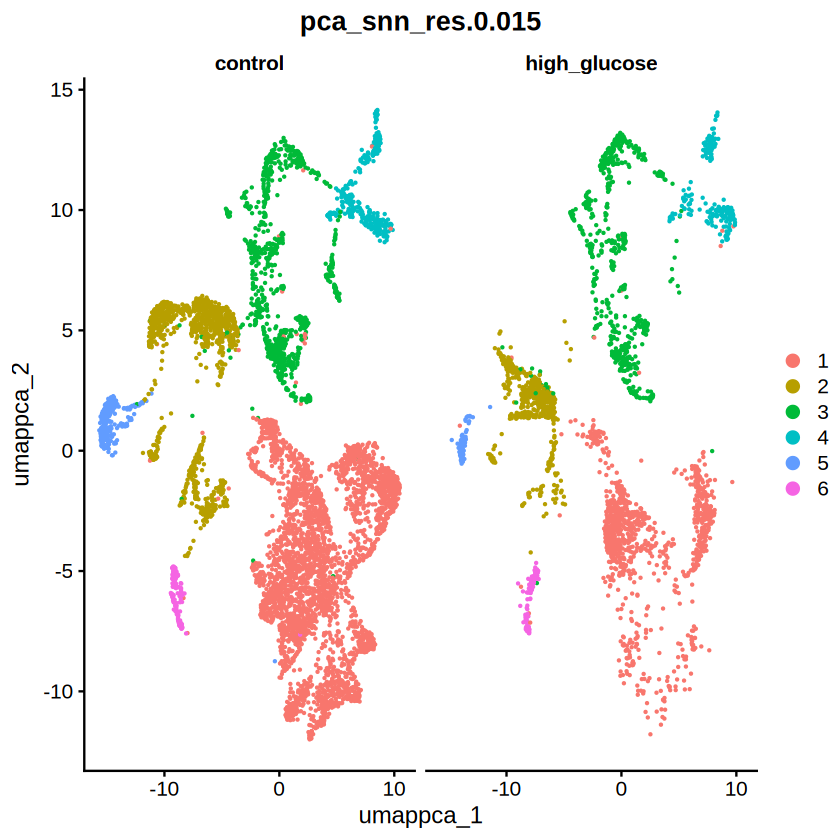
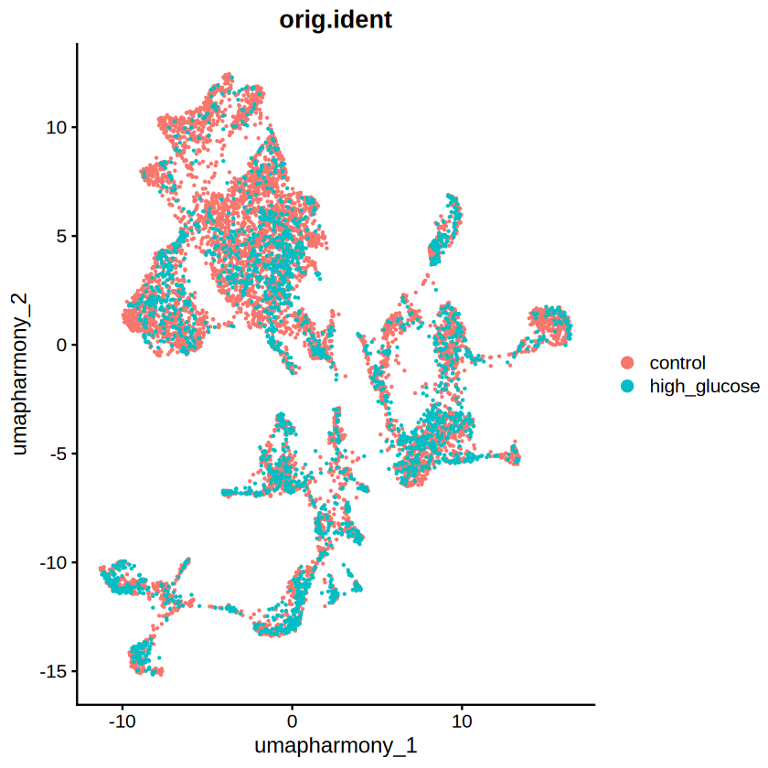
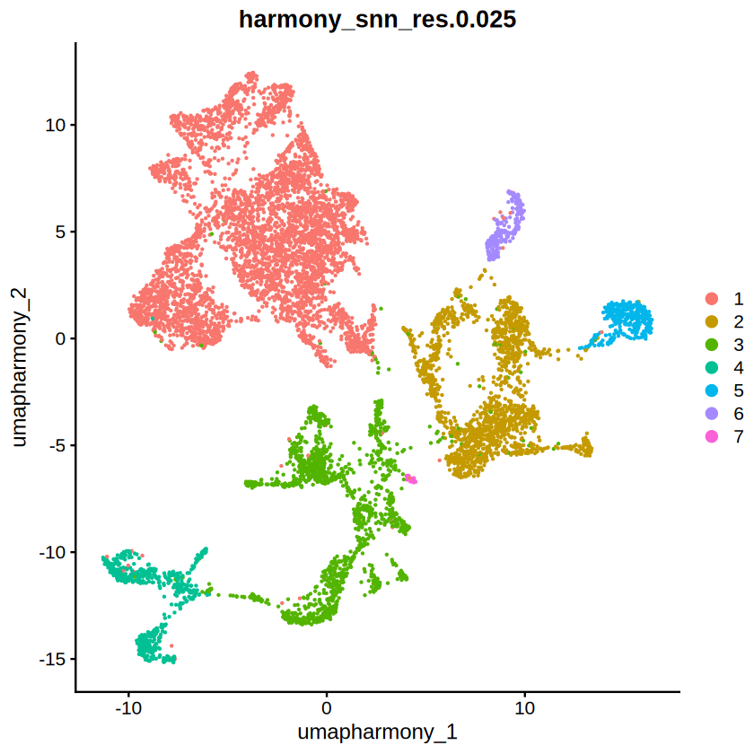
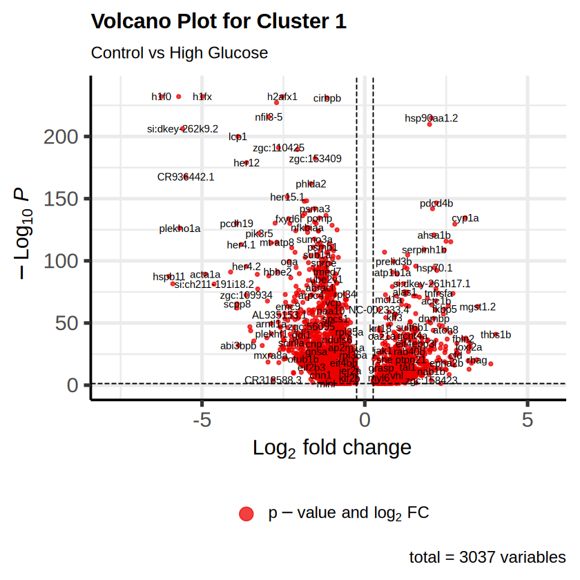
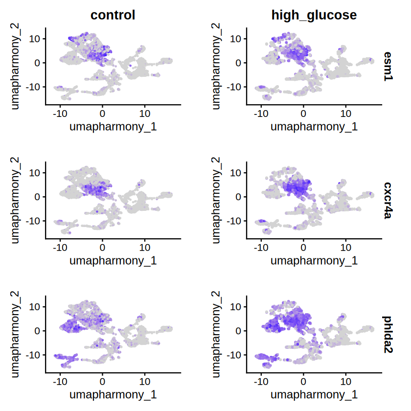
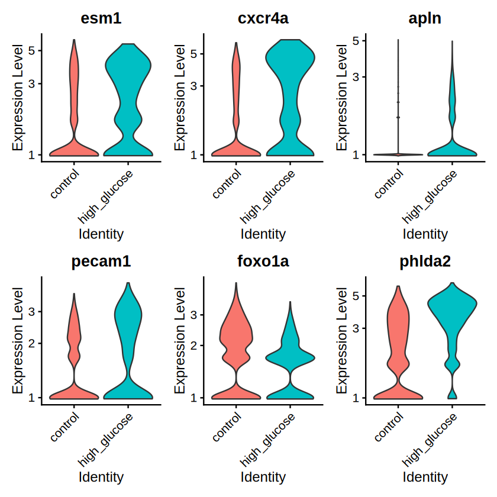

# Single-Cell RNA Sequencing Analysis of Zebrafish Endothelial Cells

This repository contains the analysis pipeline for single-cell RNA sequencing (scRNA-seq) of endothelial cells in control and high glucose-treated zebrafish embryos. The objective of this analysis is to investigate the transcriptomic differences induced by high glucose exposure, which has been shown to promote excessive angiogenesis in zebrafish models. The analysis was performed using the Seurat package in R, incorporating key steps such as quality control, clustering, data integration with Harmony, and differential gene expression analysis.

## Analysis Workflow

1. **Quality Control and Filtering**
   - Low-quality cells were filtered based on adaptive thresholds for log-transformed RNA counts, feature counts, and mitochondrial content.
   
   
   
   *Figure 1. Filter out low-quality cells based on log-transformed RNA counts, feature counts, and mitochondrial content.*

2. **Clustering Analysis**
   - Cells were clustered using PCA-based neighborhood detection and clustering algorithms with multiple resolution parameters.
   
   
   
   *Figure 2. Perform clustering analysis on both datasets using PCA and resolution-based clustering.*

3. **Data Integration with Harmony**
   - Batch effects were corrected using Harmony to integrate control and high glucose-treated datasets, followed by clustering and visualization via UMAP.
   
   
   
   
   *Figure 3. Integrate the control and high glucose-treated datasets using Harmony to mitigate batch effects.*

4. **Differential Gene Expression Analysis**
   - Differentially expressed genes (DEGs) were identified per cluster using Wilcoxon rank-sum tests with adjusted p-values.
   
   
   
   *Figure 4.1 Identify differentially expressed genes (DEGs) between the control and treated zebrafishes for each cell cluster. Example for cluster 1 using a volcano plot.*

   
   
   *Figure 4.2 Feature expression plots of esm1, cxcr4a, and phlda2 (DEGs) across conditions. The right panel represents the high glucose condition, demonstrating increased expression levels compared to the control condition on the left.*

   
   
   *Figure 4.3 Violin plots illustrating the expression distribution of esm1, cxcr4a, apln, pecam1, foxo1a, and phlda2 (DEGs) across experimental groups.*

---

This is a reanalysis of the published dataset [GSE276251](https://www.ncbi.nlm.nih.gov/geo/query/acc.cgi?acc=GSE276251). The original study investigated the effects of high glucose exposure on zebrafish endothelial cells, revealing an augmented ratio of capillary and proliferating endothelial cells, along with upregulated proangiogenic genes.